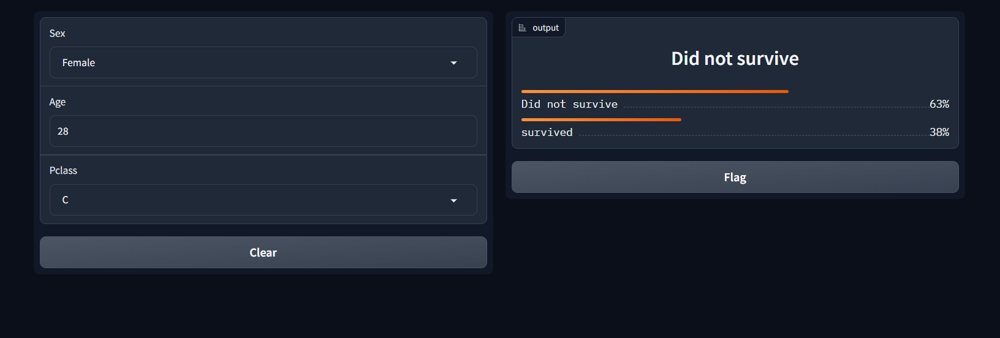

# Titanic Survived

Dados obtidos do Kaggle: 
https://www.kaggle.com/competitions/titanic/data

Após a análise dos dados... algumas conclusões:

- o dataset possui um total de 891 passageiros,
- a quantidade total de sobreviventes é 342 passageiros que equivale a 38%,
- 65% dos passageiros são homens, ou seja, havia mais homens do que mulheres,
- 74% dos sobreviventes são mulheres,
- há uma alta correlação entre o sexo das pessoas e a Sobrevivencia,
- há uma correlação de 0.34 negativa nas variaveis Pclass e Survived,
- a classe que mais pessoas sobreviveram foi a classe 1,
- a média das idades das mulheres que sobreviveram é de 28 anos,
- a moda da idade dos passageiros é 24 anos.

O modelo de Machine Learning utilizado foi o Decision Tree, com acuracia de 66%. Após a análise e criação do modelo, foi feito a visualização do modelo utilizando o Gradio e deploy com o Hugging Face.
O modelo verifica de acordo com os dados de entrada se há chances ou não de sobreviver, de acordo com: sexo, idade e classe.

Deploy: https://huggingface.co/spaces/britobeatriz/titanic_survived

